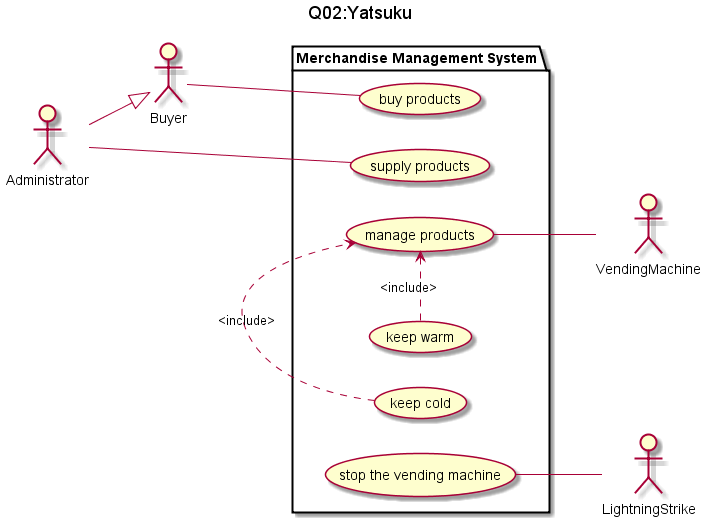

#ユースケース

#商品を購入する
  
|              |              |
|--------------|--------------|  
|ユースケース名|商品を購入する|  
|主アクタ      |購入客 管理者 |  
|事前条件      |なし          |  
|事後条件      |商品が手に入る|  

###主シナリオ

1.購入客は販売機の商品を確認する  
2.購入客は販売機にお金を投入する  
3.販売機は投入された金額を表示する  
4.購入客は商品を決める  
5.販売機は投入金額が商品の値段を満たしていた場合、商品を排出する  
6.購入客は商品を手に入れる  
  
###副シナリオ

1.販売機は投入金額が商品の値段を満たしていない場合、商品を排出しない  
2.一定時間経過した後、商品が選ばれなかったか金額に変化がない場合、投入された金額を返却する  

---

#商品を供給する
  
|              |                              |
|--------------|------------------------------|  
|ユースケース名|商品を供給する                |  
|主アクタ      |管理者                        |  
|事前条件      |供給する商品を所持している    |  
|事後条件      |販売機の商品のストックが増える|  

###主シナリオ

1.管理者は商品を供給する間、販売機を停止させる  
2.管理者はストックの少ない商品を確認する  
3.ストックの少ない商品を供給する  
4.販売機を再稼働させる  

###副シナリオ

1.商品のストックが供給する規則の一定量以上ならしない  

---

#商品を管理する  

|              |                              |
|--------------|------------------------------|  
|ユースケース名|商品を管理する                |  
|主アクタ      |販売機                        |  
|事前条件      |販売する商品を所持している    |  
|事後条件      |商品の温度が最適に保たれる    |  

###主シナリオ

1.販売機に冷やす商品と温める商品を設定する  
2.商品を設定された温度に保ち続ける  

###副シナリオ

1.商品の温度の設定がない場合、スイッチを赤く光らせて警告する  
2.設定された場合、緑色に戻す  

---

#販売機を止める

|              |              |
|--------------|--------------|  
|ユースケース名|機械を止める  |  
|主アクタ      |落雷          |  
|事前条件      |天候が悪い    |  
|事後条件      |なし          |  

###主シナリオ

1.天候が悪い  
2.販売機の周辺に落雷する
3.販売機に許容範囲以上の電圧が流れる  
4.販売機の活動を停止する  

###副シナリオ

1.販売機にアースが設置されている  
2.落雷した時に電流が地面に流れる  
3.販売機は許容範囲の電圧が流れている限り稼働を続ける  

---
