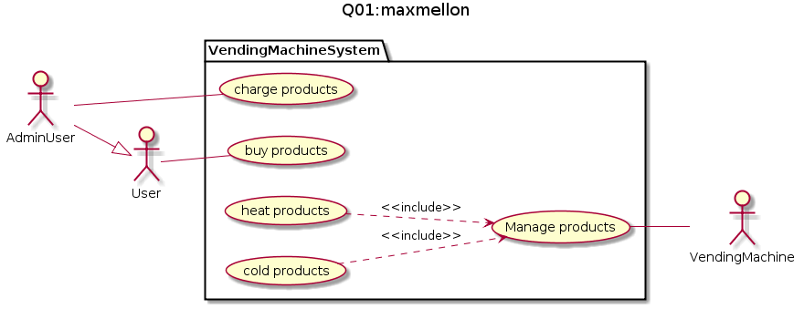

# ユースケース

# ユースケースシナリオ

## 商品を購入する

|               |                |
|---------------|----------------|
|ユースケース名 | 商品を購入する |
|アクター       | User, AdminUser |
|事前条件       | 自動販売機に0個以上の商品がセットされている |
|トリガー       | ユーザーがお金を投入する |

### 主成分シナリオ：

1. ユーザーは商品一覧を確認する

2. ユーザーは資金を投入する

3. システムは投入された金額を表示する

4. ユーザーは購入を希望する商品を決める

5. システムは投入金額が購入志望商品の価格を満たしていた時，商品を取出口に排出する

6. ユーザは商品を取り出す

保証 ： ユーザーは，投入金額以下の商品を購入することができる

## 商品を補充する

|               |                |
|---------------|----------------|
|ユースケース名 | 商品を補充する |
|アクター       | User, AdminUser |
